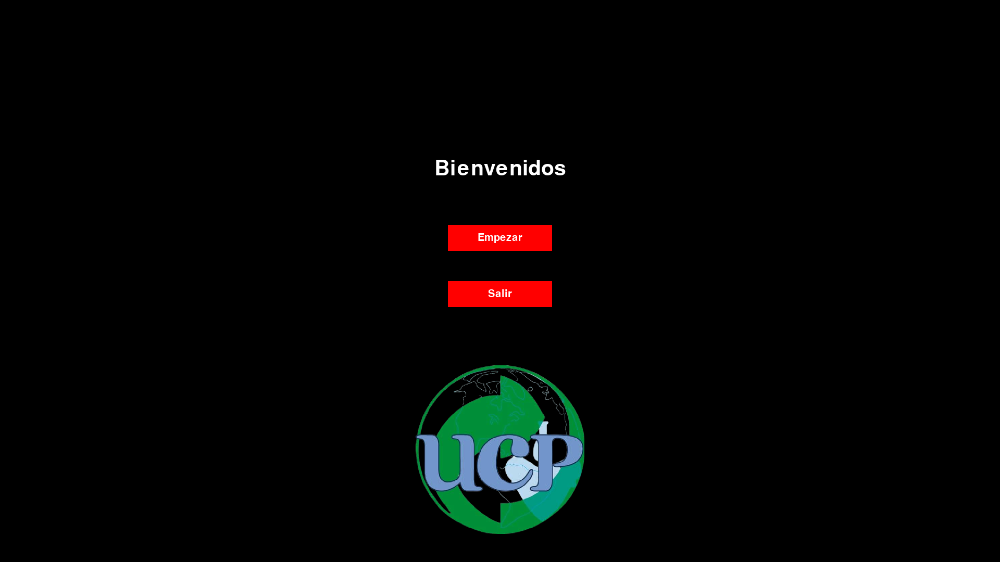
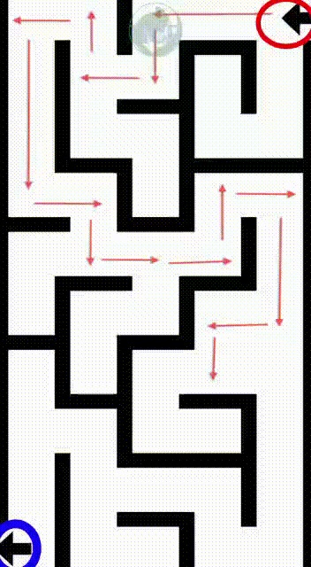
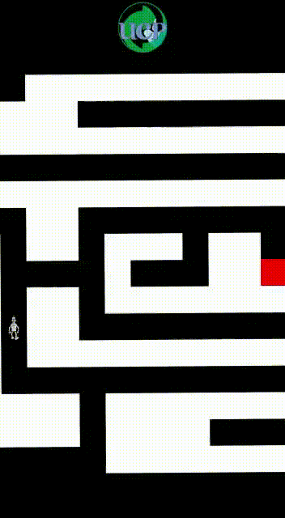

<h1 align="center">
  <br>
  <p align="center"></p>
  <br>
  Universitarios por el Cuidado del Planeta
  <br>
</h1>

<h2 align="center">Implementación de algoritmo BFS para resolver laberintos discretos</h2>
<br>


<h3> Tabla de contenidos</h3>
<ol>
  <li><a href="#sobre-proyecto">Sobre el proyecto</a>
  <ol>
    <li><a href="#estructura-proyecto">Estructura del proyecto</a></li>
  </ol>
  <li><a href="#Requisitos">Requisitos</a>
  <li><a href="#Instalación">Instalación</a>
  <li><a href="#Funcionamiento">¿Cómo funciona el código?</a>
  </li>
  <ol>
    <li><a href="#Arboles">Los árboles en programación</a></li>
    <li><a href="#BFS">El algoritmo BFS</a></li>
    <li><a href="#Aplicación">Aplicación del algoritmo BFS en la resolución de laberintos</a></li>
  </ol>
  <li><a href="#Autores">Autores</a>
</ol>
<br>

<h3 id="sobre-proyecto">Sobre el proyecto </h3>
<p align="justify">Este proyecto reúne distintos conocimientos de programación para implmentar un algoritmo de inteligencia artificial denominado BFS (Breadth First Search) para resolver un laberinto a través de desplazamientos discretos (arriba, abajo, izquierda, derecha) sobre un laberinto previamente definido.</p>

<p align="justify">Para lograr una visualización del resultado de la solución de los laberintos, la librería pygame es empleada, ya que incluye funcionalidades para renderizar, incluir sonidos, crear ventanas, entre muchas más, con la intención de crear un entorno gráfico que represente la solución de los laberintos.</p>

<h4 id="estructura-proyecto">Estructura del proyecto</h4>

<p align="justify">El lenguaje con el que se construyeron cada uno de los ejecutables es Python y está estructurado en 5 módulos distintos:</p>

<ul>
  <li><p align="justify">laberinto_automatico: Donde está contenida la lógica que implementa un algoritmo de tipo BFS.</p></li>
  <li><p align="justify">laberintos: Aquí están definidos los laberintos en un arreglo, representado con espacios (' ') para pasillos, numeral ('#') para paredes, R para el inicio y X para la meta.</p></li>
  <li><p align="justify">main: En este módulo es donde se define toda la ejecución de manera conjunta de los demás módulos.</p></li>
  <li><p align="justify">maze_generator: Define gráficamente los laberintos y así como el resultado visual de la trayectoria que sigue el robot para solucionar el laberinto. </p></li>
  <li><p align="justify">start_screen: Aquí se estructuran los menús, el de inicio y el de selección de laberintos.</p></li>
</ul>
<br>

<p align="center"></figcaption></p>
<p align="center">Menú principal</p>

<h3 id="Requisitos">Requisitos </h3>
<p align="justify">Es necesario tener <a href="https://www.python.org/downloads/">Python 3</a> instalado en el sistema operativo, así como <a href="https://www.pygame.org/news">Pygame</a> dentro de las libreías descargadas. Para instalar Pygame es posible hacerlo a través del gestor de descargas pip:</p>
<br>

```
pip install pygame
```

<h3 id="Instalación">Instalación </h3>
<p align="justify">Este repositorio tiene más de un proyecto contenidos en la <a href="https://github.com/UCPECO/Algoritmos_UCP">la página inicial</a>, si solo se quiere instalar este algoritmo, abra una terminal (debe tener <a href="https://git-scm.com/">git</a> instalado)  y ejecute los siguientes comandos: </p>

```
mkdir algoritmo_bfs && cd algoritmo_bfs
git init
git remote add origin https://github.com/UCPECO/Algoritmos_UCP.git
git config core.sparseCheckout true
echo "Inteligencia_artificial/laberinto_automatico/*">> .git/info/sparse-checkout
git pull origin master
```

<h3 id="Funcionamiento">¿Cómo funciona el código? </h3>
<p align="justify">Los laberintos que se plasman son laberintos discretos, por lo tanto, los movimientos son también discretos. La idea es que el robot pueda llegar a la meta recorriendo todos los caminos, pasando primero por los más cercanos para encontrar el camino más corto. Para esto, es posible ocupar un algoritmo de búsqueda llamado BFS. Para entenderlo, primero debemos entender a la estructura de datos "árbol".</p>

<h4 id="Arboles">Los árboles en programación </h4>
<p align="justify">Los árboles son un tipo de estructura de datos muy útil. Estos permiten almacenar la información en nodos establecidos con una jerarquía, es decir, los que se encuentren más arriba (más cercanos al origen) tienen un nivel más bajo. Existe un nodo origen que es único, llamado también nodo "raíz" y cada uno de los nodos derivados son nodos "rama" que son hijos un nodo del cual parten, sus nodos padres.</p>

<p align="center"><p align="center"></p></p>


<h4 id="BFS">El algoritmo BFS </h4>
<p align="justify">Aprovechando la estructura de datos de un árbol, es posible hacer distintas operaciones sobre él, como el recorrido que se hace sobre la estructura del árbol para analizar cada uno de los nodos. Una de las formas de recorrer el árbol es a través de un algoritmo BFS (Breadth First Search) que hace un recorrido primero por los nodos más cercanos a la raíz, es decir, recorre todos los nodos que hay en cada nivel.</p>

<p align="center"><p align="center"></p></p>

<h4 id="Aplicación">Aplicación del algoritmo BFS en la resolución de laberintos</h4>
<p align="justify"> El algoritmo DFS es muy útil para esta aplicación. Al tratarse de un laberinto discreto, es posible almacenar cada una de las posiciones de este laberinto en una estructura de datos tipo árbol, representando el inicio con el nodo raíz. Los siguientes nodos están organizados en niveles, el nivel representa el número de movimientos necesarios para llegar a ese punto, así almacenando una estructura completa con cada nodo. </p>

<p align="justify">El algoritmo creará un árbol con todos los caminos recorridos. Cuando llegue a la meta, dejará de crear más nodos con los siguientes recorridos y muestra finalmente en una renderización hecha con Pygame todos los nodos que representan el camino que deberá recorrerse para llegar a la meta por el camino más corto.</p>

<p align="center"></p>


<h3 id="Autores">Autores</h3>


